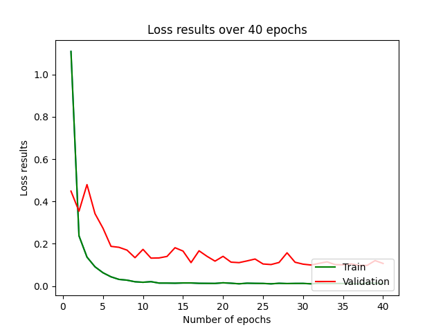
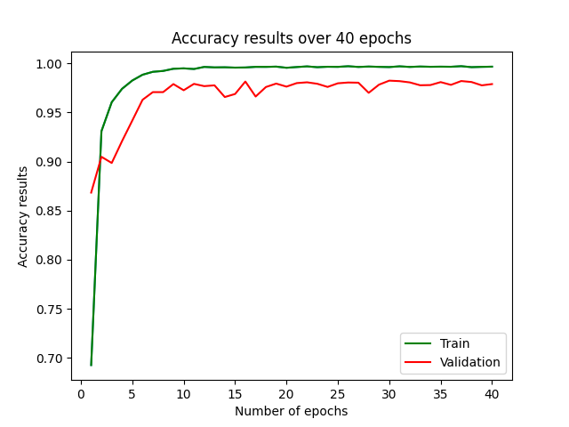
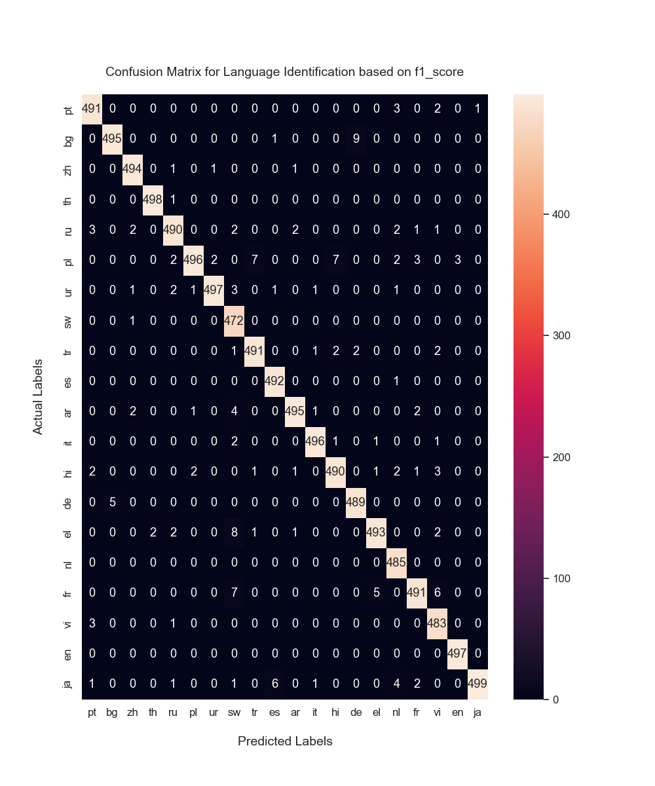

# Language Identification
## Goal
Given text by user prompt or text file 'input_text.txt' in input_data folder (which is generated automatically), language of the text data is detected. For now macro F1 score (0.98) was achieved by Bi-LSTM model.
## Model 
Bi-LSTM model along with FCN on the top of it was built for the classification task. Model configuration can be found in [model.py](model.py).

## Dataset
Dataset is loaded from [HuggingFace](https://www.huggingface.com). The chosen [dataset](https://huggingface.co/datasets/papluca/language-identification), was splitted into train, validation and test sets which include 70k, 10k, 10k texts and their corresponding labels.
## Play around 
In order to test model you can follow the steps that are given: 
* Initially, you need to pull the project into your local machine; 
* Them, you should run the following snippet to install all required dependencies: 
  ```python
  python main.py -r requirements.txt
* If you want to train the model, the following snippet will be enough to run the best configuration that we got. (Configuration can be seen in [utilities.py](utilities.py).) 
  ```python
  python main.py --train --experiment_num 2

* If you want to jump direct to inference section: (Configuration can be seen in [utilities.py](utilities.py).)
  
* with text file input (do not forget add input_text.txt into input_data folder)
    ```python
      python main.py --infer --experiment_num 1 --from_file
* with user prompt
    ```python
      python main.py --infer --experiment_num 1
## Guidelines to load model parameters
* The best trained model parameters can be found in [model]([drive](https://drive.google.com/file/d/11tzH89_RsxlcDpzmchJGUD-yYa-5OZOn/view?usp=drive_link)https://drive.google.com/file/d/11tzH89_RsxlcDpzmchJGUD-yYa-5OZOn/view?usp=drive_link)  and [optimizer](https://drive.google.com/file/d/11wV0UkyaFCvNTapNOguwnWM3274zhztD/view?usp=sharing) links
* Download and put it to the specified experiment folder (experiment_1)
* then execute the following snippet:
    ```python
      python main.py --infer --epoch_choice 30

# Results:
Model was trained for 40 epochs and here are results of our model:
* Loss and accuracy graphs of Train and Validation phases:
  <p align="center">
       
 </p>

* Confusion Matrix according to the best f1_score 
    <p align="center">
     
     </p>
* Confusion Matrix according to the minimal validation loss 
    <p align="center">
     
     </p>
* Confusion Matrix according to the best validation accuracy 
    <p align="center">
     
     </p>

# Further details:
* In the [statistics.py](statistics.py) because of the typo, when you run the code, accuracy figure will be overwritten on the loss figure. There is quick fix:
  ```python
      self.plot_graph(list(results['epoch']), list(results['train_accuracy']), list(results['dev_accuracy']),
                        experiment_dir=experiment_dir, type_data='accuracy')
